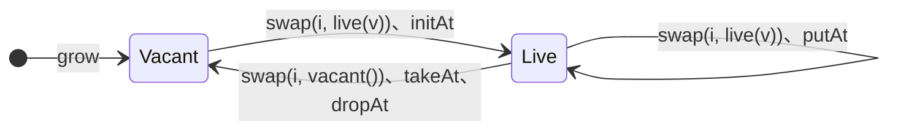

# responsibilityの図

Status: Exploratory support document

この文書は、slotの状態遷移と、placeに対するresponsibilityの動きを図示する。意味論の核は
[Poolの意味論](semantics.md#最小核の導出)、各operationの`share`と`drop`の回数と順序は[runtime contract](../runtime/contract.md#responsibility)を正とする。

## slotの状態遷移



| slotの遷移 | 値を返す | 値を返さない |
|---|---|---|
| Live → Vacant | `takeAt`、`swap`（Move） | `dropAt`（Drop） |
| Live → Live | `peek`、`getAt`（Share） | `putAt`（Move、Drop） |
| Vacant → Live | — | `initAt`（Move） |

核の`swap`は表のどの書き込みにもなり、古い値を返すか捨てるかで値を返す列と返さない列に分かれる。

## responsibilityの動き

以下の図では、`[ · ]`をVacantなslot、`[ v● ]`をLiveなslot、`●`を値へのresponsibility一つとする。Vacantの`Unit`は
responsibilityを持たない。

```text
Share   x●   →  x●  x●     responsibilityを一つ増やす
Move    x●   →  x●         responsibilityを増やさず持ち主を変える
Drop    x●   →  (なし)     responsibilityを一つ終了する
```

これはsource semanticsから導く実行上の台帳であり、丸一つがreference countの1とは限らない。reference countを使う表現ならShareと
Dropがcountを増減し、最後のDropが解放を起こし得る。別の回収表現でも上のresponsibility lawは変わらない。

placeに対する操作は読み出しと入れ替えの二つの規則で動き、Headerとslotで同じである。書き込みは入れ替えの結果を捨てたもの
である。

```text
peek(i)、header           読む       placeの値をShareして返す
swap(i, s)、swapHeader    入れ替え   sをplaceへMoveし、古い値を結果へMoveする
slot(i, s)、setHeader     書く       入れ替えた古い値をDropする
```

周辺のoperationは、この規則を特定のslotの値に当てはめたものである。

```text
getAt(i)       Live → Live          Share
  前   [ v● ]
  後   [ v● ]          結果 v●

initAt(i, x)   Vacant → Live        xをslotへMove
  前   [ · ]           x●
  後   [ x● ]

dropAt(i)      Live → Vacant        vをDrop
  前   [ v● ]
  後   [ · ]

takeAt(i)      Live → Vacant        vを結果へMove
  前   [ v● ]
  後   [ · ]           結果 v●

putAt(i, x)    Live → Live          xをMoveしてからvをDrop
  前   [ v● ]          x●
  後   [ x● ]

moveAt(a, b)   a: Live → Vacant、b: Vacant → Live      vをaからbへMove
  前   a[ v● ]   b[ · ]
  後   a[ · ]    b[ v● ]
```

`initAt`へ渡すxを後でも使う場合は、call siteのexecution ownershipが渡す前に`Share`する。primitiveは渡されたresponsibilityを
受け取るだけである。

## 意味論が同じで費用が違うoperation

最終状態が同じなら、sourceからは区別できない。違うのは、途中でresponsibilityが一時的に二つになるかである。

```text
peekの後にslot(i, vacant())    [ v● ]  →  [ v● ]  v●  →  [ · ]  v●     Share 1回、Drop 1回
swap(i, vacant())               [ v● ]  →  [ · ]  v●                    0回
```

`peek`と`swap`を別々に核に置き、`takeAt`と`moveAt`を`swap`で書く理由はこの差であり、意味論ではない。`putAt`の、新しい値を置いてから古い値を
Dropする順序も費用の層に属し、同じ値を書き戻したときに先に解放しないためにある。`getAt`、`initAt`、`putAt`、`takeAt`は
さらにLiveかVacantかを未検査preconditionとして仮定し、tagの分岐を省く。

## ImPoolの更新

snapshot carrier `p`はstorage `S`へのresponsibilityを持つ。更新は
[writable successor](../runtime/contract.md#writable-successor)を作ってから変更する。

```text
区別可能なreferenceがなくstorageを移せる
  p●  ─▶ S  [ a● | v● | c● ]
  putAt(p, 1, x●)
  p'● ─▶ S  [ a● | x● | c● ]           SをMove、xをMove、vをDrop

区別可能なreferenceがありcopyが要る
  p● q● ─▶ S  [ a● | v● | c● ]
  putAt(p, 1, x●)
  q●  ─▶ S   [ a● | v● | c● ]           Sはqに残る
  p'● ─▶ S'  [ a● | x● | c● ]           aとcをShareしてS'へ写し、xをMove、pの●をDrop
```

`a`や`c`がhandle carrierなら、Shareは同じreferentへのresponsibilityを一つ増やす。referent自体はcopyしないため、`S`と`S'`から
得たhandleは内側identityの変更を共有観測する。writable successorが分離するのは外側のHeader、occupancy、slot carrierである。

入れ子のImPoolは、外側から内側を`swap`で取り出せば外側のplaceが持っていたresponsibilityをMoveできる。これは外側のplaceが作る
referenceを残さないが、同じ内側のsnapshotへの別referenceがないことまでは保証しない。runtimeが区別可能なreferenceなしと
確認できればstorageをその場で書き換え、referenceがあれば通常どおりwritable successorをcopyする。

```text
outer●  ─▶ [ inner● ]
swap    ─▶ [ · ]         inner●      Moveで取り出す
更新                      inner'●     区別可能なreferenceがなければその場で書き換える
slot    ─▶ [ inner'● ]
```

`peek`の直後に外側を`slot(i, vacant())`しても同じ状態になるが、途中でShareとDropが一往復する。
