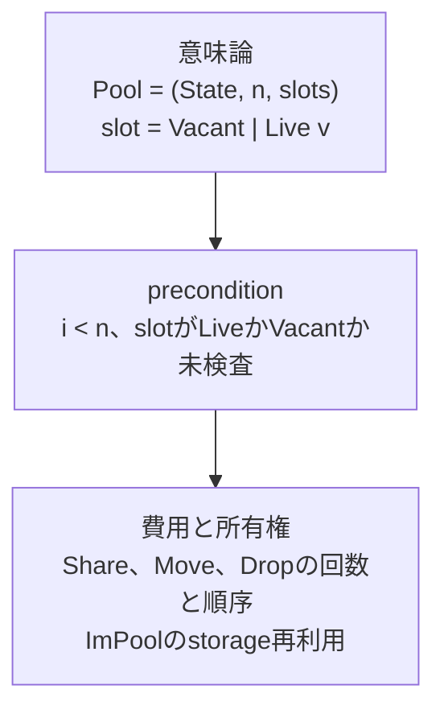
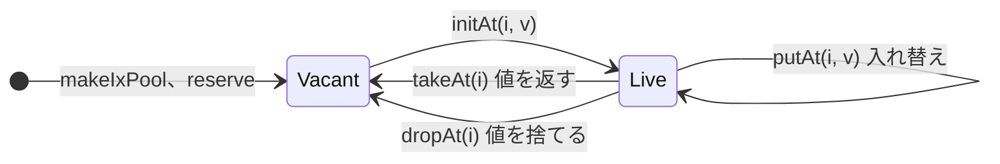
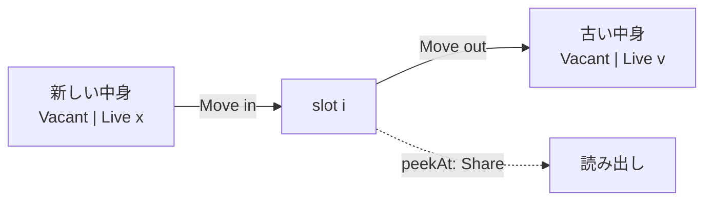

# slotモデル

Status: Exploratory support document

この文書は、Poolのslot操作をslotのVacantとLiveの遷移と、値のresponsibilityの動きに分けて図示し、意味論の最小形と、slotを
直和として出すswap案を管理する。各operationの`share`と`drop`の回数と順序は[runtime contract](runtime.md#所有権)、primitiveの
一覧は[primitive一覧](primitives.md)を正とする。

## 三つの層

slot操作の記述は三つの層に分かれる。sourceから観測できるのは意味論の層だけである。`Share`、`Consume`、`Drop`は
[managed valueのownership](../../implementation/ownership.md)の語彙であり、[仕様](../../spec/)には現れない。費用の層は、意味論が同じ
operationの間の違いを実装へ約束する。



## slotの状態遷移

slotはVacantかLiveのどちらかである。operationは、slotをどう遷移させるかと、値を返すかで決まる。



| slotの遷移 | 値を返す | 値を返さない |
|---|---|---|
| Live → Vacant | `takeAt`（Move） | `dropAt`（Drop） |
| Live → Live | `getAt`（Share） | `putAt`（Move、Drop） |
| Vacant → Live | — | `initAt`（Move） |

`takeAt`と`dropAt`は、slotから出したresponsibilityを呼び出し元へ渡すか、その場で消すかだけが違う。`getAt`と`takeAt`は、slotを
Liveのまま残すかだけが違い、残す`getAt`はslotと結果の両方がresponsibilityを持つため`Share`が要る。

## responsibilityの動き

以下の図では、`[ · ]`をVacantなslot、`[ v● ]`をLiveなslot、`●`を値へのresponsibility一つとする。

```text
Share   x●   →  x●  x●     responsibilityを一つ増やす。参照数 1 → 2
Move    x●   →  x●         持ち主だけが変わる。参照数 1 → 1
Drop    x●   →  (なし)     responsibilityを一つ消す。最後の一つなら解放する
```

```text
getAt(i)       Live → Live          Share
  前   [ v● ]
  後   [ v● ]          結果 v●

initAt(i, x)   Vacant → Live        xをslotへMove
  前   [ · ]           x●
  後   [ x● ]

dropAt(i)      Live → Vacant        vをDrop
  前   [ v● ]
  後   [ · ]

takeAt(i)      Live → Vacant        vを結果へMove
  前   [ v● ]
  後   [ · ]           結果 v●

putAt(i, x)    Live → Live          xをMoveしてからvをDrop
  前   [ v● ]          x●
  後   [ x● ]

moveAt(a, b)   a: Live → Vacant、b: Vacant → Live      vをaからbへMove
  前   a[ v● ]   b[ · ]
  後   a[ · ]    b[ v● ]
```

`initAt`へ渡すxを後でも使う場合は、call siteのexecution ownershipが渡す前に`Share`する。primitiveは渡されたresponsibilityを
受け取るだけである。

## 意味論の最小形

Poolの状態は`(State, n, slots)`であり、`slots`は`[0, n)`の各coordinateに`Vacant`か`Live v`を割り当てる。最小のoperationは
次の八つである。

| operation | 意味 | precondition |
|---|---|---|
| `state`、`capacity` | Stateと`n`を返す | なし |
| `isLive(i)` | `slots[i]`がLiveかを返す | `i < n` |
| `getAt(i)` | `slots[i] = Live v`の`v`を返す | Live |
| `setState(s)` | Stateを`s`にする | なし |
| `reserve(m)` | `n`を`max(n, m)`にし、増えたslotをVacantにする | なし |
| `initAt(i, v)` | `slots[i] := Live v` | Vacant |
| `dropAt(i)` | `slots[i] := Vacant` | Live |

他のoperationは意味の上でこれらの合成である。

```text
takeAt(i)     = v := getAt(i); dropAt(i); v
putAt(i, v)   = dropAt(i); initAt(i, v)
moveAt(a, b)  = initAt(b, takeAt(a))
```

ImPoolは同じ`(State, n, slots)`を値として持ち、各operationは新しい状態を返す関数として同じ定義を持つ。例えば
`takeAt(p, i) = (dropAt(p, i), getAt(p, i))`である。IxPoolとImPoolの違いは、この状態を共有identityに置くか、値として渡すかだけになる。

[runtime contract](runtime.md#所有権)は所有権の遷移から出発し、`initAt`と`takeAt`を核、`getAt`を`take`と`init`の合成とする。
意味論から出発すると`getAt`と`dropAt`が核になり、`takeAt`は派生になる。二つの分解は層が違い、どちらも成り立つ。

## 意味論が同じで費用が違うoperation

最終状態が同じなら、sourceからは区別できない。違うのは、途中でresponsibilityが一時的に二つになるかである。

```text
getAtの後にdropAt    [ v● ]  →  [ v● ]  v●  →  [ · ]  v●     Share 1回、Drop 1回
takeAt               [ v● ]  →  [ · ]  v●                    0回
```

`takeAt`と`moveAt`をprimitiveにする理由はこの差であり、意味論ではない。`putAt`の、新しい値を置いてから古い値をDropする順序も
費用の層に属し、同じ値を書き戻したときに先に解放しないためにある。

## ImPoolの更新

handle `p`はstorage `S`へのresponsibilityを持つ。更新は[writable successor](runtime.md#writable-successor)を作ってから変更する。

```text
入力が唯一
  p●  ─▶ S  [ a● | v● | c● ]
  putAt(p, 1, x●)
  p'● ─▶ S  [ a● | x● | c● ]           SをMove、xをMove、vをDrop

入力が共有
  p● q● ─▶ S  [ a● | v● | c● ]
  putAt(p, 1, x●)
  q●  ─▶ S   [ a● | v● | c● ]           Sはqに残る
  p'● ─▶ S'  [ a● | x● | c● ]           aとcをShareしてS'へ写し、xをMove、pの●をDrop
```

入れ子のImPoolは、`getAt`の直後に外側を`dropAt`すれば内側のresponsibilityが一つに戻り、その場で更新できる。

```text
outer●  ─▶ [ inner● ]
getAt   ─▶ [ inner● ]   inner●      innerの●は二つ
dropAt  ─▶ [ · ]        inner●      一つに戻る
更新                     inner'●     唯一なのでその場で書き換える
initAt  ─▶ [ inner'● ]
```

ImPoolの`takeAt`は、最初の二段を一つのMoveにする費用primitiveに当たる。

## malの設計方針との対応

[minimality](../../design/minimality.md)、[表現と関係を分ける](../../design/representation-and-relations.md)、
[値、解釈、control](../../design/value-interpretation-and-control.md)に照らすと、このモデルには次の性質がある。

VacantとLiveはmalの直和`[Unit, T]`そのものである。意味論の上では、IxPoolはStateと`[Unit, T]`の有限列を持つ共有identityであり、
新しい概念を足していない。[Buffer上のemulation](prototypes.md#二つの試作)が同じ意味を再現できたのはこのためである。

Moveは値の消費ではなく、placeの状態遷移として現れる。malの値は再利用できるcarrierであり、affineなのはcontrolだけである。
`takeAt`は値を消費せずslotをVacantにするため、所有権の移動にlinear typeやborrow checkerを要しない。

IxPoolはcoordinateで引く有限carrierであり、Liveな集合の形とcoordinateの意味はcontainerのoperationとinvariantが与える。これは
`finite carrier + relation operations + invariants = domain structure`の形にそのまま当てはまる。

一方、現在のAPIは意味論の直和を隠した占有状態として持ち、LiveとVacantの一致を未検査preconditionにしている。直和と並ぶ独立の
contractが一つ増え、minimalityが数える「独立して理解すべきcontract」を増やす。また`initAt`と`putAt`はどちらも`slot := Live v`、
`takeAt`と`dropAt`はどちらも`slot := Vacant`であり、書き込み四つはpreconditionと戻り値だけが違う。

## swap案

slotの中身を`[Unit, T]`として出し、書き込みを一つの`swapAt`にまとめる案である。`swapAt`は新しい中身をMoveで入れ、古い中身を
Moveで返す。読み出しは`Share`する`peekAt`になる。

```mal
Slot<T> :: [Unit, T];

peekAt<S, T> :: (IxPool<S, T>, USize) -> Slot<T>;
swapAt<S, T> :: (IxPool<S, T>, USize, Slot<T>) -> Slot<T>;
swapState<S, T> :: (IxPool<S, T>, S) -> S;
```

`state`、`capacity`、`reserve`は現在と同じである。他のoperationは次のように書ける。

```text
takeAt(i)     = swapAt(i, Vacant)              Live vを返す
initAt(i, v)  = swapAt(i, Live v)              Vacantを返し、捨てる
putAt(i, v)   = swapAt(i, Live v)              Live oldを返し、Dropする
dropAt(i)     = swapAt(i, Vacant)              Live vを返し、Dropする
moveAt(a, b)  = swapAt(b, swapAt(a, Vacant))   Vacantを返す
isLive(i)     = peekAt(i)[() -> false, (_) -> true]
```



| | 現在のモデル | swap案 |
|---|---|---|
| slotの状態 | 隠した占有metadata | `[Unit, T]`として見える |
| 書き込みprimitive | `initAt`、`takeAt`と派生 | `swapAt` |
| 未検査precondition | 範囲、LiveとVacantの一致 | 範囲 |
| LiveとVacantの不一致 | 二重Drop、Vacantの読み出し | 返る直和の値として現れる |
| ImPool | 更新ごとにsuccessorを返す | `swapAt`が`(ImPool, Slot<T>)`を返す |
| 追加の費用 | — | 返った直和をDropする時のtag分岐、`isLive`でpayloadを`Share`しない最適化 |

swap案では、IxPoolと`Buffer<[Unit, T]>`の違いが、swapによるMoveと、tagをslotの外に置く表現の二点に絞られる。どちらも費用の層
であり、意味論はmalの既存の直和で書ける。速さが要る場所には、Liveを仮定する未検査の`getAt`などを費用primitiveとして残せる。
