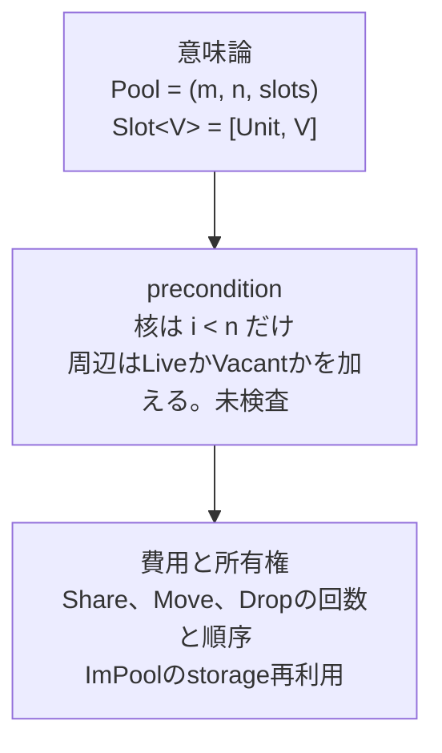
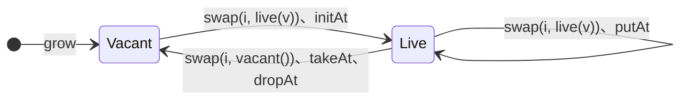

# slotモデル

Status: Exploratory support document

この文書は、Poolの意味論の核を導き、placeに対するresponsibilityの動きを図示し、malの設計方針との対応を管理する。核と周辺の
一覧と区分は[primitive一覧](primitives.md)、各operationの`share`と`drop`の回数と順序は[runtime contract](runtime.md#所有権)を
正とする。

## 三つの層

Poolの記述は三つの層に分かれる。sourceから観測できるのは意味論の層だけである。`Share`、`Consume`、`Drop`は
[managed valueのownership](../../implementation/ownership.md)の語彙であり、[仕様](../../spec/)には現れない。費用の層は、意味論が同じ
operationの間の違いを実装へ約束する。



## placeと値

IxPoolは`(m, n, slots)`を一つの共有identityとして持つ。Metaの`m`と各slotは、どちらも値をちょうど一つ持つplaceである。

```text
place  meta       : Meta
place  slot 0..n-1 : Slot<V>      Slot<V> :: [Unit, V]
```

Vacantは値がない状態ではなく、`Slot<V>`の第一項という値である。Liveは第二項である。VacantとLiveという区別はmalの直和の
variantとして現れ、Poolが別に持つ概念ではない。

### Metaとslot

Metaとslotは同じ規則のplaceであり、違いは持つ値の型だけである。この違いはplaceを作るoperationから来る。

- `pool(m)`はMetaの初期値を受け取るため、Metaは最初から`Meta`の値を持つ。
- `grow(pool, k)`はk個のslotを値なしで作る。任意の`V`には既定値がないため、新しいslotには`Unit`を置き、slotの型は`Slot<V>`になる。
- slotから値を取り出した後も、placeは何かの値を持つ必要があり、`Unit`を置く。

## 最小核の導出

核は`pool`、`grow`、`capacity`、`peek`、`swap`、`meta`、`swapMeta`である。意味論の最小と、primitiveとして持つ操作の最小は
一致しない。

| place | 意味論の最小 | 操作の最小 | 派生 |
|---|---|---|---|
| slot | `swap` | `peek`、`swap` | `slot` |
| Meta | `meta`と`swapMeta` | `meta`、`swapMeta` | `setMeta` |

### slot

意味の上では、slotは`swap`だけで閉じる。`swap`はplaceの値を入れ替えて古い値を返し、Vacantという値があるため、交換の間に
置いておく値に困らない。

```text
slot(i, s)     = swap(i, s)の結果を捨てる
peek(i)        = r := swap(i, vacant()); _ := swap(i, r); r
```

`peek`の分解で`r`を二回使えるのは、malの値が再利用できるからである。それでも`peek`を核に置くのは、読み出しを書き込みに
しないためである。分解すると読み出しが二回の書き込みになり、[freeze](primitives.md#freezeとthaw)で共有したstorageをcopyし、
費用も一回のreadから二回のwriteに増える。逆に`slot`は核に置かない。`swap`の結果を呼び出し側でDropしても、primitive内で
旧値をDropしても費用は同じであり、`slot`だけでは値をMoveで取り出せない。

他のslot operationは`peek`と`swap`の合成である。Liveかどうかは結果の除去で分かる。

```text
isLive(i)      = peek(i)[() -> false, (_) -> true]
initAt(i, v)   = slot(i, live(v))
putAt(i, v)    = slot(i, live(v))
dropAt(i)      = slot(i, vacant())
takeAt(i)      = swap(i, vacant())のLiveの値
moveAt(a, b)   = slot(b, swap(a, vacant()))
```

### Meta

Metaの型には、任意の型について用意できる値がない。交換の間に置いておく値がないため、`meta`は`swapMeta`から導けず、
読み出しと交換の二つが意味論の最小になる。

```text
setMeta(m)     = swapMeta(m)の結果を捨てる
swapMeta(m)    = r := meta(); setMeta(m); r
```

containerがMetaを`[Unit, X]`のような直和にすれば、Metaも`swapMeta`だけで閉じる。これはcontainerの選択である。

### 構造の操作

`capacity`は`n`を読む。`n`はPool自身の構造であり、`peek`と`swap`のpreconditionが参照する。

`grow`は、identityを保ったままcoordinate空間を広げる唯一のoperationである。新しいPoolを作って要素を移すと、古いPoolの
aliasは新しいPoolを追えない。identityを共有するというIxPoolの性質を成長の後も保つために`grow`が要る。

`pool`は新しいidentityを作る唯一のoperationである。`n`を`0`で始め、大きさは`grow`で与える。

### MetaをPoolに置く理由

malには可変なbindingもproductのfieldをその場で書き換える手段もない。`(Meta, IxPool<Unit, V>)`というproductのMetaは値として
copyされるため、変更をaliasが観測できない。Metaはどこかのidentityの中に置く必要がある。

意味の上では、Metaは容量1のPoolのslot 0を同じidentityへ融合したものである。

```text
IxPool<Meta, V>  ≅  (IxPool<Unit, Meta>, IxPool<Unit, V>)    二つが同じidentityを共有し、第一Poolのslot 0は常にLive

meta(pool)         = peek(metaPool, 0)のLiveの値
swapMeta(pool, m)  = swap(metaPool, 0, live(m))のLiveの値
```

融合すると、分離した形でcontainerのinvariantだった「slot 0は常にLive」を型が保証する。Metaは`Slot`で包まず、preconditionも
持たない。分離した形との違いは、identity、allocation、handleのcopyごとのretainが一つで済むことである。

`grow`しない`IxPool<Meta, V>`は、Metaだけを持つ可変なcellとして使える。

ImPoolでは、Metaは`(Meta, ImPool<Unit, V>)`というproductと同じであり、productごと更新できる。MetaをPoolに置く必要があるのは
identityを共有するIxPoolだけである。

## slotの状態遷移



| slotの遷移 | 値を返す | 値を返さない |
|---|---|---|
| Live → Vacant | `takeAt`、`swap`（Move） | `dropAt`（Drop） |
| Live → Live | `peek`、`getAt`（Share） | `putAt`（Move、Drop） |
| Vacant → Live | — | `initAt`（Move） |

核の`swap`は表のどの書き込みにもなり、古い値を返すか捨てるかで値を返す列と返さない列に分かれる。

## responsibilityの動き

以下の図では、`[ · ]`をVacantなslot、`[ v● ]`をLiveなslot、`●`を値へのresponsibility一つとする。Vacantの`Unit`は
responsibilityを持たない。

```text
Share   x●   →  x●  x●     responsibilityを一つ増やす。参照数 1 → 2
Move    x●   →  x●         持ち主だけが変わる。参照数 1 → 1
Drop    x●   →  (なし)     responsibilityを一つ消す。最後の一つなら解放する
```

placeに対する操作は読み出しと入れ替えの二つの規則で動き、Metaとslotで同じである。書き込みは入れ替えの結果を捨てたもの
である。

```text
peek(i)、meta             読む       placeの値をShareして返す
swap(i, s)、swapMeta      入れ替え   sをplaceへMoveし、古い値を結果へMoveする
slot(i, s)、setMeta       書く       入れ替えた古い値をDropする
```

周辺のoperationは、この規則を特定のslotの値に当てはめたものである。

```text
getAt(i)       Live → Live          Share
  前   [ v● ]
  後   [ v● ]          結果 v●

initAt(i, x)   Vacant → Live        xをslotへMove
  前   [ · ]           x●
  後   [ x● ]

dropAt(i)      Live → Vacant        vをDrop
  前   [ v● ]
  後   [ · ]

takeAt(i)      Live → Vacant        vを結果へMove
  前   [ v● ]
  後   [ · ]           結果 v●

putAt(i, x)    Live → Live          xをMoveしてからvをDrop
  前   [ v● ]          x●
  後   [ x● ]

moveAt(a, b)   a: Live → Vacant、b: Vacant → Live      vをaからbへMove
  前   a[ v● ]   b[ · ]
  後   a[ · ]    b[ v● ]
```

`initAt`へ渡すxを後でも使う場合は、call siteのexecution ownershipが渡す前に`Share`する。primitiveは渡されたresponsibilityを
受け取るだけである。

## 意味論が同じで費用が違うoperation

最終状態が同じなら、sourceからは区別できない。違うのは、途中でresponsibilityが一時的に二つになるかである。

```text
peekの後にslot(i, vacant())    [ v● ]  →  [ v● ]  v●  →  [ · ]  v●     Share 1回、Drop 1回
swap(i, vacant())               [ v● ]  →  [ · ]  v●                    0回
```

`peek`と`swap`を別々に核に置き、`takeAt`と`moveAt`を`swap`で書く理由はこの差であり、意味論ではない。`putAt`の、新しい値を置いてから古い値を
Dropする順序も費用の層に属し、同じ値を書き戻したときに先に解放しないためにある。`getAt`、`initAt`、`putAt`、`takeAt`は
さらにLiveかVacantかを未検査preconditionとして仮定し、tagの分岐を省く。

## ImPoolの更新

handle `p`はstorage `S`へのresponsibilityを持つ。更新は[writable successor](runtime.md#writable-successor)を作ってから変更する。

```text
入力が唯一
  p●  ─▶ S  [ a● | v● | c● ]
  putAt(p, 1, x●)
  p'● ─▶ S  [ a● | x● | c● ]           SをMove、xをMove、vをDrop

入力が共有
  p● q● ─▶ S  [ a● | v● | c● ]
  putAt(p, 1, x●)
  q●  ─▶ S   [ a● | v● | c● ]           Sはqに残る
  p'● ─▶ S'  [ a● | x● | c● ]           aとcをShareしてS'へ写し、xをMove、pの●をDrop
```

入れ子のImPoolは、外側から内側を`swap`で取り出せば内側のresponsibilityが一つのまま更新でき、その場で書き換えられる。

```text
outer●  ─▶ [ inner● ]
swap    ─▶ [ · ]         inner●      Moveで取り出す
更新                      inner'●     唯一なのでその場で書き換える
slot    ─▶ [ inner'● ]
```

`peek`の直後に外側を`slot(i, vacant())`しても同じ状態になるが、途中でShareとDropが一往復する。

## malの設計方針との対応

[minimality](../../design/minimality.md)、[表現と関係を分ける](../../design/representation-and-relations.md)、
[値、解釈、control](../../design/value-interpretation-and-control.md)に照らすと、このモデルには次の性質がある。

意味論が新しく持ち込むのは、可変なidentityと、`n`を広げる`grow`だけである。slotの占有はmalの直和`[Unit, V]`で表し、Metaと
slotは同じ規則のplaceである。IxPoolは、Metaと`Slot<V>`の有限列を持つ共有identityと言える。
[Buffer上のemulation](prototypes.md#二つの試作)が同じ意味を再現できたのは、Bufferが同じplaceの列を持つからである。

Moveは値の消費ではなく、placeの値の入れ替えとして現れる。malの値は再利用できるcarrierであり、affineなのはcontrolだけである。
`swap`は値を消費せずplaceへ`Unit`を残すため、所有権の移動にlinear typeやborrow checkerを要しない。

IxPoolはcoordinateで引く有限carrierであり、Liveな集合の形とcoordinateの意味はcontainerのoperationとinvariantが与える。これは
`finite carrier + relation operations + invariants = domain structure`の形にそのまま当てはまる。

核の未検査preconditionは範囲`i < n`だけである。LiveとVacantの一致は核では直和の除去で扱われ、違反はmemory safetyではなく
返る値に現れる。周辺の`getAt`、`initAt`、`putAt`、`takeAt`はこの一致を再び未検査preconditionにして費用を下げる。containerは
核だけで書くか、invariantで一致を保証して周辺を使うかを選べる。

IxPoolと`Buffer<[Unit, V]>`の違いは、`swap`によるMoveと、tagをslotの外に置けるlayoutの二点に絞られる。どちらも費用の層であり、
[論理構造とlayoutを分ける](../../design/representation-and-relations.md#論理構造とlayout)方針の一例になる。
